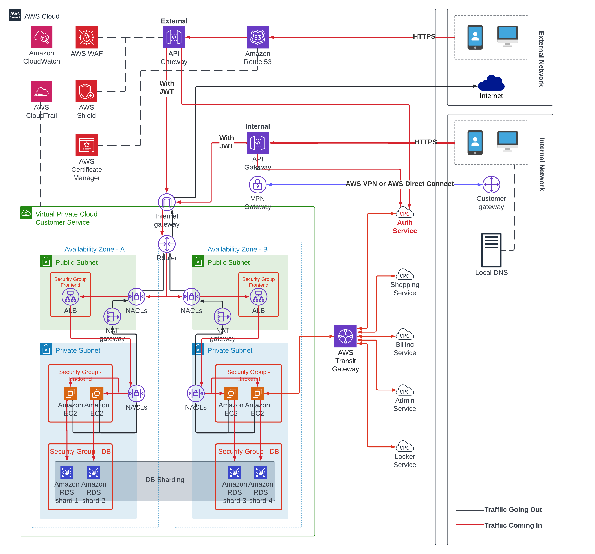

# ReClothes

This repository contains all deliverables for [Student IT Architecture Competition 2022](https://www.citap.org/) that started from Dec 2021 to May 2022. 
Thank you to the SITAC organization and my teammate Ruoran Wang. Through this five-month competition we design our business solution from scratch and created associated tech solution to address pain points.

## What is ReClothes

ReClothes is a platform that bridges clothes donors, second-hand clothes buyers and scrap factory. ReClothes support the business functions include donation module, second clothes online marketplace, last-mile delivery service, and enterprise management platform.

## Main Business Processes

## Business Architecture

## Data Architecture

For Data Architecture, we used the Data-Driven Design method and separate the whole platform into 6 domains. Each of them is a bounded context and is responsible for resolving a set of problems. We got the admin domain that focuses on activities related to the internal users. And customer domain that focuses on activities related to the external users. Auth domain is responsible for authentication and authorization. The locker domain focuses on the drop-off box and the drop-off location. The shopping domain focuses on browsing used clothes and the management of shopping carts.

## Tech Architecture

We used event-driven microservices architecture to achieve the scalability of the platform. In this diagram, we split the platform into several layers. We got the front-end layer, API layer, services layer, data layer, and infrastructure layer. In the front-end layer, we got loader balancers to distribute traffic loads equally. And we also used CDN to improve the speed of retrieving static resources. In the infrastructure layer, we build a Kubernetes cluster on top of the cloud provider.
In the API layer, we used the external API gateway and the internal API gateway to distribute traffic loads coming from different users. By using these two API gateways, we can set different access control and throttling strategy for them. Next, in the service layer, we got six microservices to serve requests. For developing these microservices, we got a microservices chassis that contains service discovery, centralized config service, circuit breaker, tracing, and logging. For the payment, the billing service needs to connect with some third-party services, such as Stripe or PayPal. Next is our data layer, each service needs to connect with its independent databases. For example, the shopping service uses the document DB to store the used clothes. Using the in-memory database to store the shopping cart data. Using the relational database for the persistence of the shopping cart data.

## Tech Stack

## Deployment Architecture

## Security Architecture

